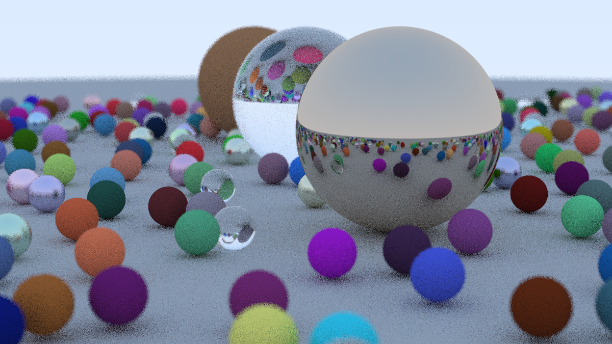
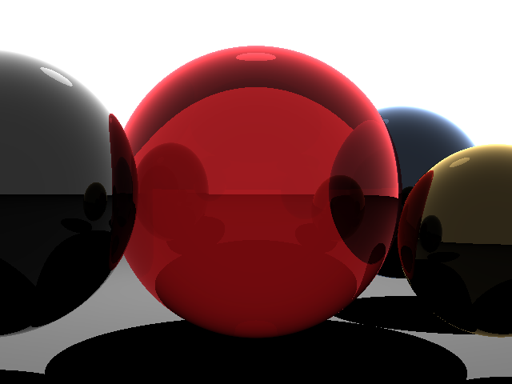
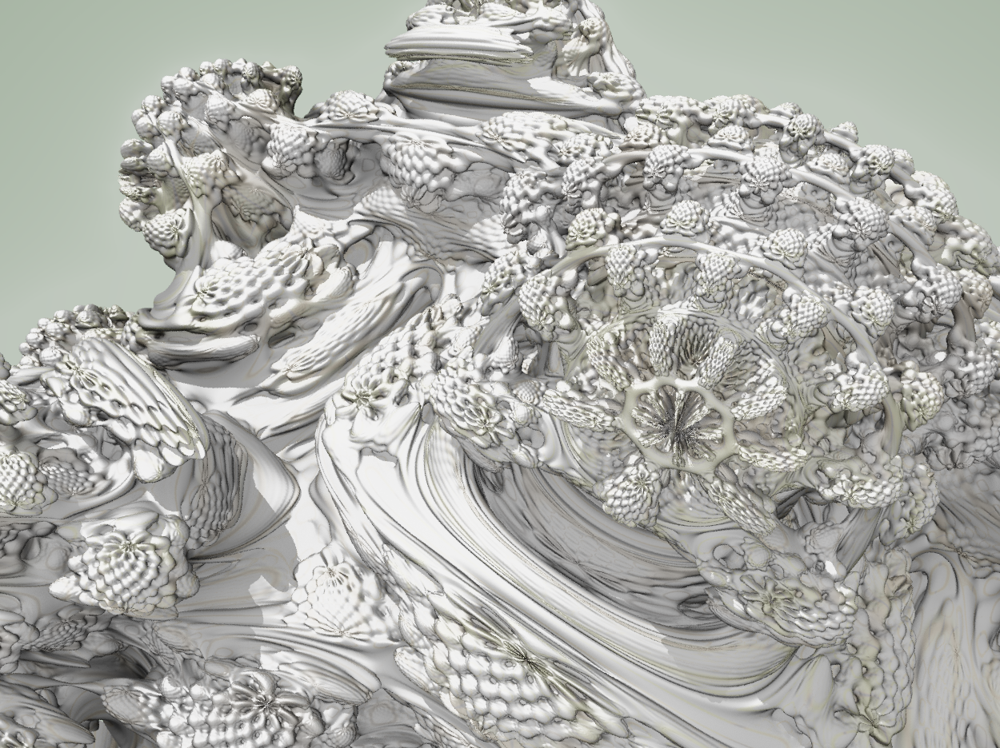
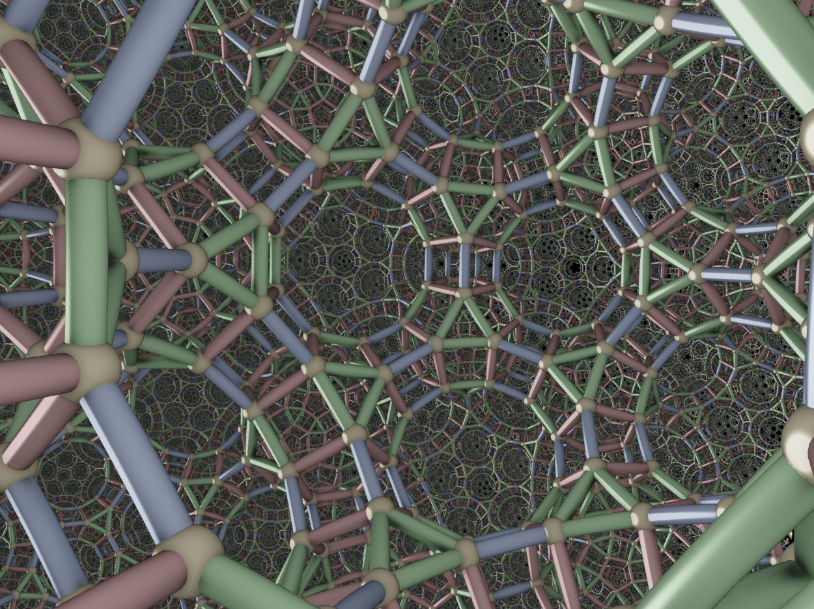
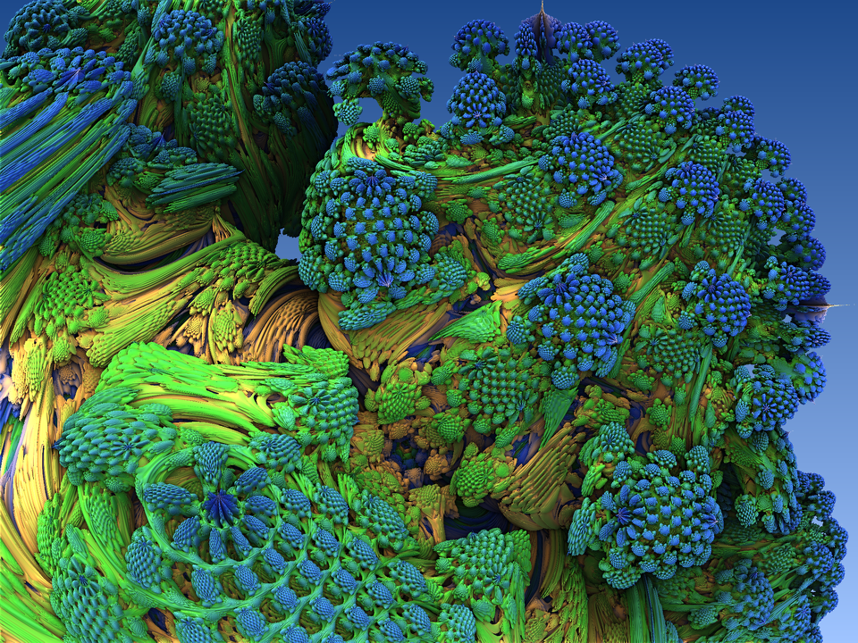

[//]: # (Must use %20 instead of space in filepaths)

# My ray marching experiments

## Mandel bulb

## Mandel bulb cross section

## Union

## Intersection

## Subtraction

## Smooth Union

## Smooth Intersection

## Smooth Subtraction

## Surface Normals

## Phong Shading

# smallpt

## InOneWeekend book series

# simple 

# Fragmentarium

# Mandelbulb3D
 
